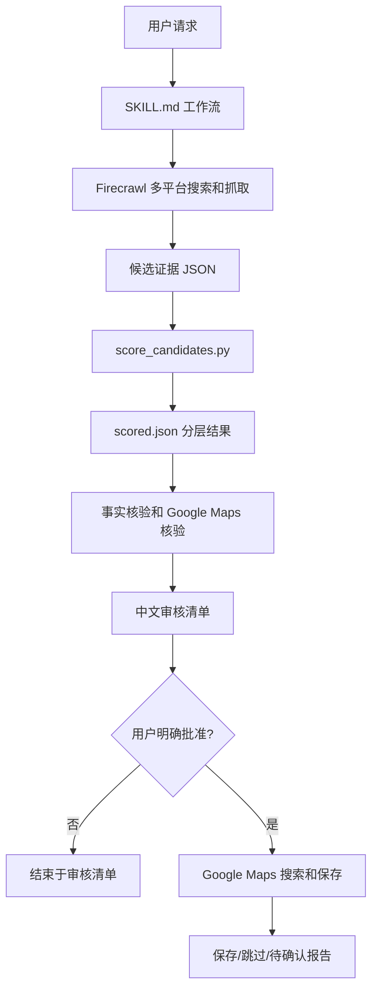

# travel-research-maps 架构说明

## 文档目的

说明 Firecrawl 多平台来源扩展后的模块职责、数据流、外部依赖和信任边界。

## 适用范围

适用于 `travel-research-maps/` 目录下的 skill 指令、参考规则、确定性评分脚本、测试和 Codex UI 配置。本文档仅根据当前仓库可见内容整理；未在仓库中找到证据的内容均不做假设。

## Plan 或项目证据

| 模块 | 职责 |
| --- | --- |
| `SKILL.md` | 定义触发条件、Firecrawl 研究流程、覆盖门槛、输出格式和地图写入条件。 |
| `references/scoring-rubric.md` | 定义多平台证据、推荐档位、营销识别、分层和事实核验优先级。 |
| `scripts/score_candidates.py` | 对已收集证据做离线去重、日期过滤、营销排除、计分、平台统计和分层。 |
| `scripts/test_score_candidates.py` | 覆盖评分阈值、负面证据、营销/重复/过期过滤、严重风险和平台门槛。 |
| `agents/openai.yaml` | 定义 Codex 中展示名称、短描述和默认提示词。 |

## 系统形态

## 数据流或控制流

1. `SKILL.md` 根据用户请求提取目的地和日期。
2. Codex 通过 Firecrawl 搜索、抓取和抽取公开可访问的多平台旅行内容。
3. 操作者把候选证据整理为 JSON，包含候选名称、类别、来源、URL、作者或频道、发布日期、推荐立场、营销标记、内容指纹和摘要。
4. `score_candidates.py` 读取 JSON，输出每个候选的分层、净分、正负来源数、正向平台、有效证据和被排除证据统计。
5. Codex 对优先去和备选项目做事实核验，并用 Google Maps 核验地址、营业状态、关闭风险和地点匹配。
6. 用户批准后，Codex 才进入 Google Maps 保存流程。

## 外部依赖

| 依赖 | 用途 | 边界 |
| --- | --- | --- |
| Firecrawl MCP | 公开网页搜索、抓取、抽取和必要时 map/agent 研究 | 不绕过登录墙、验证码、付费墙或反爬限制；搜索后提交 feedback。 |
| 小红书、Bilibili、YouTube、Instagram、X 等平台 | 提供旅行内容证据 | 只有可识别作者、日期和立场的公开内容可计分。 |
| Google Maps | 核验风险、营业状态、地点匹配和批准后的列表保存 | 评论不直接计入推荐分；写入前必须用户批准。 |
| Python 3 标准库 | 运行评分脚本和 unittest | 仓库没有声明额外依赖。 |

## 安全和信任边界

- `score_candidates.py` 不做网络请求，只处理本地输入 JSON。
- Firecrawl 只用于公开可访问内容，不尝试绕过平台访问控制。
- Google Maps 写入是外部副作用，必须由用户明确批准。
- 凭据、Cookie、token、私钥和 `.env` 值不得进入代码、日志、文档或响应。

## 被否决的重要备选方案

| 方案 | 当前结论 | 理由 |
| --- | --- | --- |
| 继续把 Chrome 已登录小红书作为主路径 | 不采用 | 稳定性受账号状态、验证码和页面限制影响。 |
| Firecrawl 不可用时自动退回内置 web search | 不采用 | 用户要求 Firecrawl 作为更稳定的数据提供路径，回退会改变证据质量边界。 |
| 评分脚本直接联网抓取事实 | 不采用 | 会破坏离线确定性和可测试性。 |
| 输出日程式旅行计划 | 不采用 | 当前 skill 定位是地点审核清单和地图收藏。 |

## 实现指引

- 新增证据字段时，先在 `references/scoring-rubric.md` 说明语义，再在 `score_candidates.py` 和测试中实现。
- 新增外部研究能力时，必须同步更新 `SKILL.md` 的安全边界和 `security-privacy.md`。
- 不要把 Firecrawl、浏览器自动化或 Google Maps 写入细节放进评分脚本。

## 验收标准

- 模块职责清晰，外部研究、事实核验和确定性评分没有混在同一层。
- 评分脚本仍可在无网络、无浏览器会话情况下运行测试。
- 外部副作用仅发生在 `SKILL.md` 规定的人工批准之后。

## 待确认

- 是否需要把证据 JSON schema 单独抽成参考文档。
